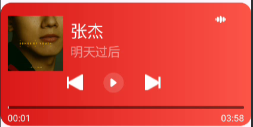

# JyqMediaSession

通过MediaSession 去实现了 第三方音乐播放器 的双向控制监听

## 使用方式

### 一

直接使用MusicPlayerView 到xml布局文件中

### 二

自定义一个View,然后使用MusicPlayManager 重新封装控制自定义view中的逻辑处理，可参考MusicPlayerView

## 注意事项

1.使用mediaSession 必须需要android版本5.0以上
2.需要配置不同的播放器MusicNotifyService 中修改isMusicApp 中可使用的 应用的包名
目前支持：

```
   private boolean isMusicApp(String packageName) {
        // 根据常见音乐 App 包名来判断
        return packageName.equals("com.netease.cloudmusic") ||       // 网易云音乐
                packageName.equals("com.tencent.qqmusic") ||          // QQ 音乐
                packageName.equals("com.kugou.android") ||            // 酷狗
                packageName.equals("com.kugou.android.watch.lite");// 酷狗手表
    }
```
## 界面效果如下图

