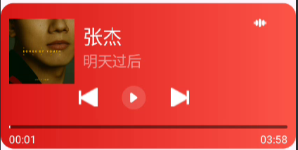
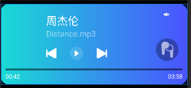

# JyqMediaSession

通过MediaSession 去实现了 第三方音乐播放器 的双向控制监听

## 使用方式一 android5.0以上

### 一

直接使用MusicPlayerView 到xml布局文件中

### 二

自定义一个View,然后使用MusicPlayManager 重新封装控制自定义view中的逻辑处理，可参考MusicPlayerView

## 注意事项

1.使用mediaSession 必须需要android版本5.0以上  
2.需要配置不同的播放器MusicNotifyService 中修改isMusicApp 中可使用的 应用的包名  
目前支持：

```
   private boolean isMusicApp(String packageName) {
        // 根据常见音乐 App 包名来判断
        return packageName.equals("com.netease.cloudmusic") ||       // 网易云音乐
                packageName.equals("com.tencent.qqmusic") ||          // QQ 音乐
                packageName.equals("com.kugou.android") ||            // 酷狗
                packageName.equals("com.kugou.android.watch.lite");// 酷狗手表
    }
```

## 三 界面效果如下图



## 使用方式二 android4.4以上

### 一

1.直接使用MusicPlayerView2 到xml布局文件中
2.bulid.gradle.kts 添加兼容android4.4 的依赖
3.在合适的地方调用 MusicPlayManager2.getInstance().init(this)，保证在服务启动之后调用

```
    implementation("androidx.media:media:1.6.0")

```

### 二

自定义一个View,然后使用MusicPlayManager2 重新封装控制自定义view中的逻辑处理，可参考MusicPlayerView2

### 三 界面效果如下图



## 项目 目录**结构解释说明

📦 JyqMediaSession
├── 📁 app  
│ ├── 📁 src  
│ │ ├── 📁 main  
│ │ │ ├── 📁 java  
│ │ │ └── 📁 res  
│ │ └── AndroidManifest.xml  
├── 📁 MediaSession-java  
│ │ ├── 📁 src  
│ │ ├── 📁 main  
│ │ │ ├── 📁 java.com.yq.mediaSession  
│ │ │ │ ├── 📁 media
│ │ │ │ ├── 📁 mediacompat(android4.4以上包含4.4, 使用当前文件夹中的内容)
│ │ │ │ └── 📁 widget(自定义view 包含截图中的播放器view)
│ │ │ └── 📁 res  
│ │ └── AndroidManifest.xml  
├── 📁 music_server 自己创建的服务端方便调试(仅仅在android4.4的情况下 需要手动连接服务)，一般情况下在 自己写的播放器或者第三方播放器如酷狗网易云等去实现
├── 📄 build.gradle.kts
├── 📄 README.md  
└── 📄 settings.gradle.kts

# Hi there, I'm MrJGH! 👋

## 📫 联系方式!  📧 Email: [1049944384@qq.com]

## 📫 项目github地址！ [点击查看](https://github.com/MrJGH/JyqMediaSession)
---

## 📊 GitHub Stats


---

感谢您访问我的个人资料！让我们一起创造奇迹吧！ 🚀
